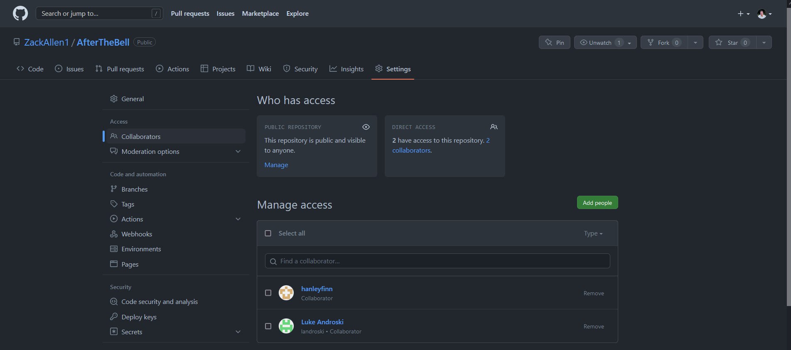
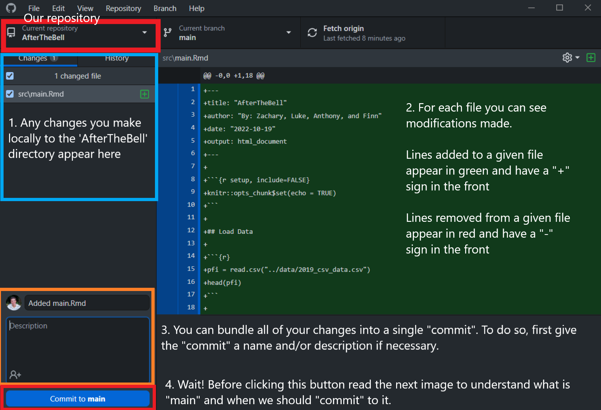
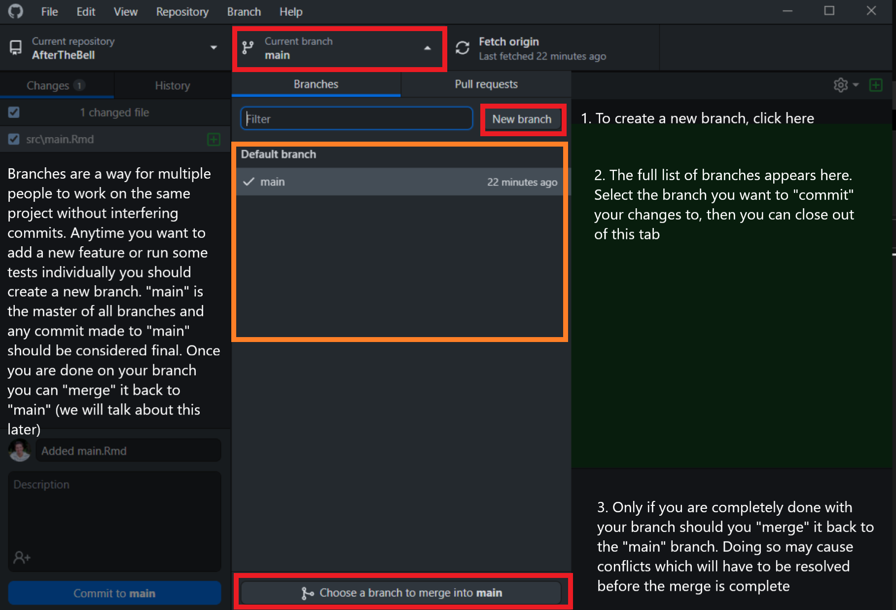
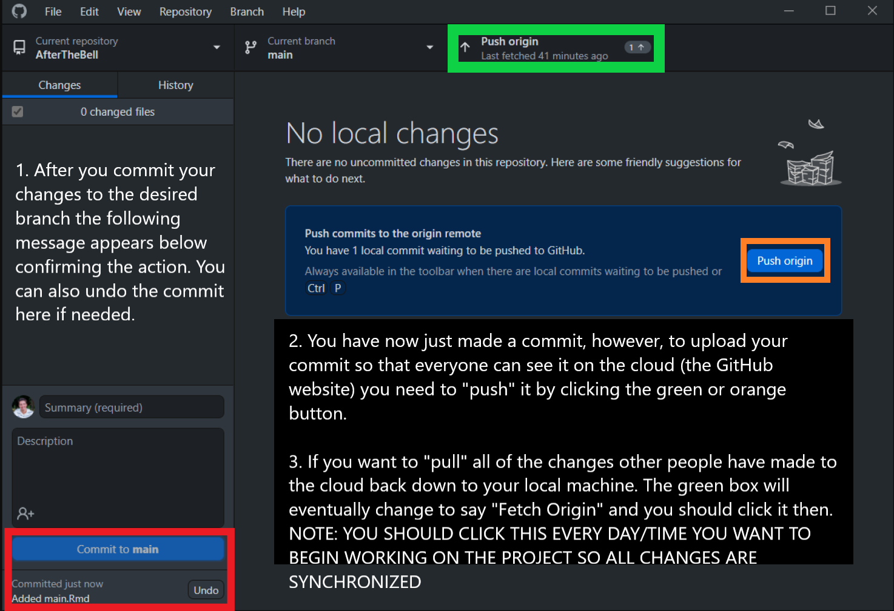

# STA3180 GitHub Help

Summary: GitHub allows us to upload, edit, and manage code as a team from a single online webpage.

## Installation

To begin using GitHub, you first need to make an account with a username (you can set up the Student Edition later).

If you are the team leader you should create a "repository" for your teams' code to be stored ([create a repo help](https://docs.github.com/en/get-started/quickstart/create-a-repo))

The team leader should add each of their members to the repository using their usernames so they can add, change, or remove files as needed.

This can be done at the following location

Then, all members should follow the instructions to [install GitHub Desktop on your computer](https://docs.github.com/en/desktop/installing-and-configuring-github-desktop/overview/getting-started-with-github-desktop)

Once you have Github Desktop installed, read the following images to set it up with the repository and understand
how you can make changes, commit those changes, then upload the commit to the GitHub website cloud.

## Connect to Our Repo

Follow the steps [here](https://docs.github.com/en/desktop/contributing-and-collaborating-using-github-desktop/adding-and-cloning-repositories/cloning-and-forking-repositories-from-github-desktop) to connect ("clone") our repo to your local machine.

You do not need to worry about the "Forking the Repository" steps.

You should now be able to see all of the files in the folder you specified as the "Local Path" on your computer.

## What are Changes and Commits

## What is a Branch

A helpful sample diagram of branches working together

## How to Upload/Download (Push/Pull) to and from the Cloud 

